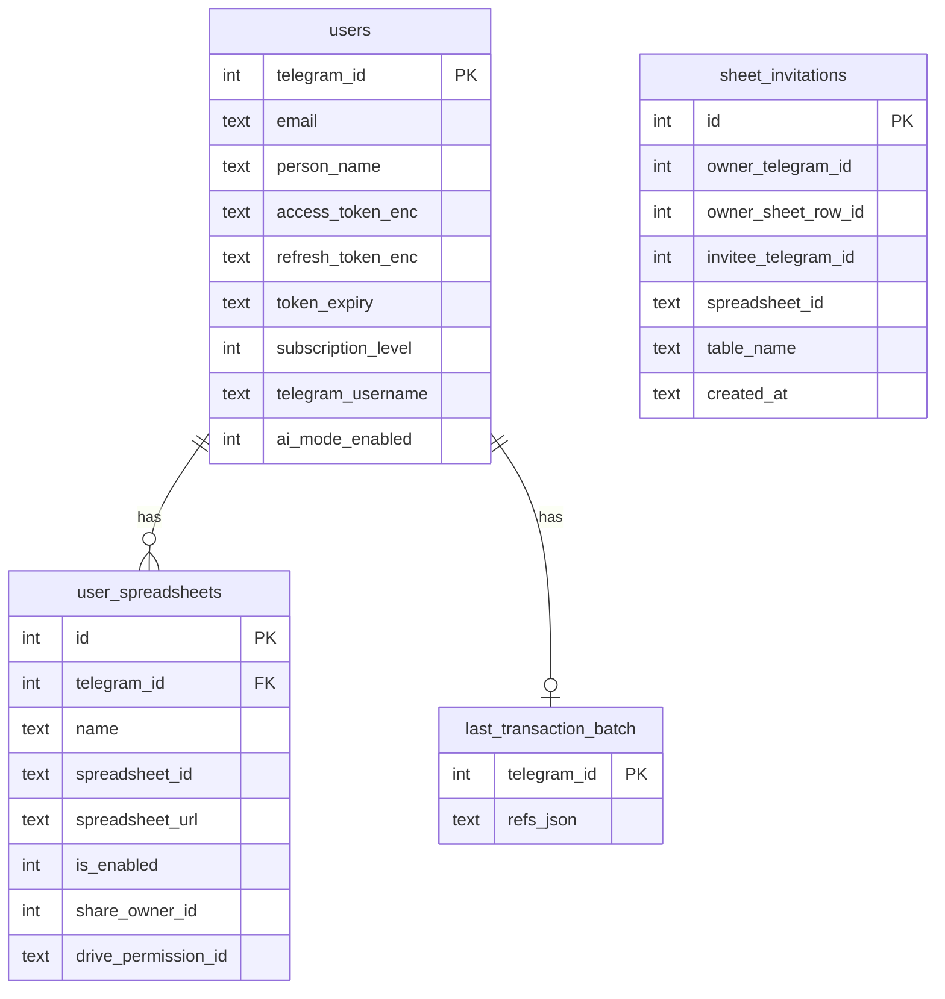

# MoneyMonkey: Telegram-бот учёта финансов с Google Таблицами и ИИ-ассистентом

---

## Титульный лист

**ПРАВИТЕЛЬСТВО РОССИЙСКОЙ ФЕДЕРАЦИИ**  
**ФГАОУ ВО НАЦИОНАЛЬНЫЙ ИССЛЕДОВАТЕЛЬСКИЙ УНИВЕРСИТЕТ**  
**«ВЫСШАЯ ШКОЛА ЭКОНОМИКИ»**

 

Факультет компьютерных наук  
Образовательная программа «Прикладная математика и информатика»

 

**Отчёт об исследовательском проекте на тему:**  
**AI-ассистент для личных финансов**

 

**Выполнил студент:**

| | |
| --- | --- |
| группы БПМИ232, 3 курса | Ляпин Никита Александрович |

**Принял руководитель проекта:**

Чимбулатов Егор Феликсович  
Научный сотрудник  
Департамент больших данных и информационного поиска ФКН ВШЭ

 

**Москва 2026**

---

## Оглавление

1. [Титульный лист](#титульный-лист)  
2. [Оглавление](#оглавление)  
3. [Аннотация](#аннотация)  
4. [Список ключевых слов](#список-ключевых-слов)  
5. [Введение](#введение)  
6. [Обзор литературы](#обзор-литературы)  
7. [Глава 1. Возможности бота и сценарии для пользователя](#глава-1-возможности-бота-и-сценарии-для-пользователя)  
8. [Глава 2. Архитектура приложения и технологический стек](#глава-2-архитектура-приложения-и-технологический-стек)  
9. [Глава 3. База данных SQLite и интеграция с Google Sheets](#глава-3-база-данных-sqlite-и-интеграция-с-google-sheets)  
10. [Глава 4. Парсинг транзакций и бизнес-логика записи](#глава-4-парсинг-транзакций-и-бизнес-логика-записи)  
11. [Глава 5. ИИ-ассистент: архитектура агента, инструменты и аналитика по данным](#глава-5-ии-ассистент-архитектура-агента-инструменты-и-аналитика-по-данным)  
12. [Заключение](#заключение)  
13. [Список литературы](#список-литературы)  

---

## Аннотация

Данный курсовой проект посвящен разработке интеллектуального Telegram-бот MoneyMonkey для
комплексного учета личных и групповых финансов. Цель – создание легковесного и доступ-
ного, но решующего боль пользователя инструмента, который объединяет гибкость элек-
тронных таблиц с удобствами телеграмма и возможностями AI.

Бот автоматически создает и структурирует персональную или общую Google Таблицу
с предустановленными листами для учета доходов, расходов, категорий и счетов. Ключевая
особенность – встроенный AI-ассистент, который способен автоматически категоризировать
транзакции по текстовому описанию и отвечать на произвольные звпросы о финансах на
естетвенном языке.

Проект реализует законченное программное решение, которое позиционируется как
альтернатива простым в использовании, но тяжелым в настройке ботам, так и сложным
финансовым приложениям, требующих установки и регистрации, а не только наличия акка-
унтов Telegram и Google.

---

## Список ключевых слов

Telegram бот, управление финансами, личный бюджет, совместные расходы, Google Таблицы, AI-ассистент, Python.

---

## Введение

С ростом доступности финансовых услуг и разнообразия способов оплаты усложня-
ется и задача контроля за денежными потоками. Пользователи ищут инструменты, которые
помогли бы им отслеживать свои финансовые привычки и развивать финансовую грамот-
ность. Однако существующие решения часто имеют недостатки: существующие боты могут
быть ограничены в функционале или сложны в настройке, специализированные программы
– дороги или избыточны, а ведение записей вручную – трудоемко и не наглядно. Возмож-
ности же AI сегодня позволяют автоматизировать настройку и монтирониг такого сервиса,
сохранив его легковестность.

Новизна и значимость работы заключается в применении AI для автоматического анализа личных финансов из всех банков, что не имеем аналогов на рынке.

Задачи проекта (План дальнейшей работы):
1. Реализовать интеграцию с **Telegram API** и **Google Sheets API**.
2. Разработать систему команд и диалогов для управления финансовыми записями (добав-
ление, редактирование, удаление операций, категорий).
3. Создать механизм автоматического формирования и структурирования **Google Таблицы**
для нового пользователя или группы.
4. Внедрить модуль **AI-ассистента** с функциями:
- Автоматической категоризации текстовых описаний расходов.
- Ответов на естественно-языковые запросы о данных в таблице.
- Автоматического парсинга запросов с транзакциями
5. Обеспечить возможность совместной работы нескольких пользователей с одной таблицей.
6. Провести продуктовое исследование и определить необходимый набор новых фичей

---

## Обзор литературы

Эта секция посвящена сравнению с существующеми решениями.

1. Специализированные мобильные и веб-приложения (CoinKeeper, Дзен-мани, MoneyFlow).
- **Преимущества**: Готовый, часто хорошо продуманный интерфейс, встроенная аналитика, об-
лачная синхронизация
- **Недостатки**: Данные пользователя хранятся на сторонних серверах, что может вызывать
вопросы безопасности. Функционал жестко задан разработчиком, нет возможности экспорта,
кастомизации отчетов, добавления специфических полей

2. Простые Telegram/мессенджер-боты для учета расходов (МОБС)
- **Преимущества**: Удобная интеграция telegram и google таблиц
- **Недостатки**: Крайне ограниченный функционал, долгая нстройка, аналитика отсутствует
или очень базовая, нет AI

Разрабатываемый бот призван устранить недостатки перечисленных выше категорий,
совместив их преимущества:
- **От ботов**: Простота старта и использования через Telegram.
- **От приложений**: Богатый функционал (аналитика, лимиты, напоминания) и встроенный
AI

---

## Глава 1. Возможности бота и сценарии для пользователя

### 1.1. Что делает бот в целом

**MoneyMonkey** помогает вести учёт доходов и расходов в гугл таблице, не открывая её каждый раз вручную: достаточно написать операцию в чат с ботом в Telegram. 
Бот подключается к гугл от вашего имени, создаёт или использует уже привязанные таблицы с заранее заданной структурой листов и дописывает строки на лист «Расходы» или «Доходы» в зависимости от категории.
Справочник категорий, надкатегорий и синонимов вы можете править прямо в таблице — бот подхватывает изменения при следующих запросах.

### 1.2. Первый запуск, онбординг

Типичный путь нового пользователя: команда начала работы в чате → переход по ссылке для входа в Google → возврат в бот после успешной выдачи прав → ввод имени
Бот создает таблицу, и в нее уже можно записывать транзакции.

### 1.3. Тарификация

Предусмотрены три уровня: базовый, Pro и Premium.

- Базовый*— полноценный учёт в одной основной таблице
- Pro — неограниченное число привязанных таблиц, совместный доступ к таблицам (приглашения соавторов через бота), теги к транзакциям через хэштеги в сообщении
- Premium — ИИ-ассистент в чате: он отвечает текстом, дает подсказки, умеет автоматически определять категории, создавать новые и читать таблицу

### 1.4. Настройка и ведение таблиц

В Pro версии доступно несколько таблиц.
По команде /tables открывается меню, где можно выдавать и забирать доступы пользваотелям по их тг нику, включать / выключать таблицы, переименовывать их
Кстати, приглашенные пользвоатели получают уведомления о приглашении и могут отклонить их или принять

### 1.5. Баланс: как смотреть

Смотреть можно по разным временным интервалам
- `/month` — с 1-го числа текущего месяца по сегодня;
- `/week`— семь календарных дней, включая сегодня (скользящее окно);
- `/day` — только сегодняшний день (с начала суток по текущий момент).

По выбранным таблицам отдельно суммируются доходы и расходы по соответствующим листам, затем показывается разница. После каждой можно указать имя таблицы и получить статистику только по одной

### 1.6. Что умеет ИИ-ассистент (Premium)

Ассистент отвечает на:
- вопросы о тратах
- просьбы записать операцию менее жёстким текстом, чем требует классический парсер
- автоматически определяет категории транзакции по смыслу запросу
- создает категории, если не нашел похожую
- любые справки по использованию бота

---

## Глава 2. Архитектура приложения и технологический стек

### 2.1. Общая схема

**Точка входа.** Система запускается из `main.py`: 
- проверка конфигурации
- логирование
- инициализация **SQLite** (`init_db`)
- создание сервисов **OAuth** и **SheetsClient** (о них далее)
- экземпляра бота **aiogram** и **Dispatcher** с **MemoryStorage**
Параллельно с pollingом Telegram поднимается небольшой **HTTP-сервер** (aiohttp) для OAuth-callback (об этом тоже далее).
В диспетчер подключается общий **router** на все приложение

Дальше расскажу о компонентах системы.

1. **Google Sheets** — хранилище финансовых данных пользователя. Транзакции, категории, теги и справочники живут в его личном Google Drive; бот через **Google Sheets API** только читает и дополняет таблицу от имени пользователя. Так пользователь сохраняет владение данными - бот не держит центральную копию журнала транзакций (это еще и позволяет нам экономить данные на диске относительно варианта, когда у себя мы держим все таблицы всех пользователей)
Понятно, что прямая выдача логина/пароля Google боту неприемлема - для этого существует протокол OAuth, которым мы и пользуемся. Для этого создан аккаунт в Google Workspace, привязан платежный счет, заданы scope - пространства досутпа в гугл. В нашем случае бот получает доступ к Sheets и Drive 
Пользователь входит в аккаунт Google в браузере и сам выдаёт приложению право работать с файлами; бот хранит только refresh/access токены - причем в зашифрованном виде и выплняет расшифровку только когда они ему нужны. Так мы гарантируем безопасность таблицы даже при взломе БД.

Для первичной авторизации поднимается отдельный сервер (callback), который имеет зарегистрированный redirect URI. Он принимает:
- code - одноразовый код, который Google выдаёт после согласия пользователя
- state - строка, отправляемая приложением, по которой мы идентифицируем пользвоателя.
Они обмениваются на токены, а токены шифруются и пишутся в SQLite.
Пользователь зарегистрирован.

Когда токен истекает (а Access токены гугла не вечны), API кидает ошибку вида invalid_grant. Бот обрабатывает ее, как и при ручном отзыве доступа к приложению и предлагает пройти авторизацию заново.

2. **SQLite** — локальная база бота с метаданными и настройками: 
- профиль Telegram-пользователя
- зашифрованные OAuth-токены
- список привязанных таблиц (`user_spreadsheets`), 
- последняя пачка операций (для удаления последней транзакции)
(Подробное описание БД будет в следующей главе)
Главное, что БД не держит транзакций пользваотелей - все остается только в таблицах

3. **Hugging Face Inference / Router** — удалённая языковая модель для Premium-режима. В рамках квоты инференс бесплатный.
Клиент в коде использует OpenAI-совместимый HTTP API: базовый URL и имя модели задаются переменными окружения и по умолчанию указывают на маршрутизатор Hugging Face. Используется жля всех агентский функций.

**Middleware.** - в aiogram это цепочка «обёрток» вокруг хендлера. до вызова хендлера можно изменить или дополнить словарь data, который получит хендлер. 
Мы польуземся этим, чтобы подкладывать в каждый хендлер клиент sheets и ключи oauth

**Поток при записи транзакции.**
Telegram → handler → (классический парсер или LLM с инструментами) → Sheets API → Google Таблица
Параллельно в SQLite обновляется last_transaction_batch для del и пакетной записи в несколько таблиц.

### 2.2. Технологии

| Компонент | Технология |
|-----------|------------|
| Runtime | Python ≥ 3.11 |
| Бот | aiogram 3.x |
| БД | SQLite + aiosqlite |
| Шифрование токенов | cryptography (Fernet) |
| Google | google-api-python-client, OAuth 2.0 (PKCE), Sheets API |
| ИИ | langchain, langchain-openai; инференс через **Hugging Face Inference / OpenAI-compatible Router** |
| Аналитика в агенте | pandas, pandasql (SQLite под капотом) |
| OAuth callback | aiohttp (`WEBAPP_HOST` / `WEBAPP_PORT`) |
| Прочее | python-dotenv |

### 2.3. Конфигурация

Параметры (токен бота, пути к секретам OAuth, ключ шифрования, URI редиректа, путь к БД) задаются через переменные окружения и хранятся в env файле.

---

## Глава 3. База данных SQLite и интеграция с Google Sheets

### 3.1. Схема базы данных

Ниже — логическая схема таблиц (связи «один ко многим» от пользователя к его таблицам и приглашениям).

Ниже — назначение каждой таблицы и каждого поля в типичных сценариях бота.

#### Таблица `users`

Центральная запись о человеке в Telegram

| Поле | Назначение |
|------|----------------------------------------|
| **`telegram_id`** (PK) | Уникальный идентификатор пользователя в Telegram. Используется везде как ключ: выборка профиля, привязка OAuth |
| **`email`** | Email из Google после успешного OAuth. Нужен для выдачи доступа к таблице другим пользвоателям через бота |
| **`person_name`** | Имя, которое бот подставляет в колонку «Человек» при записи транзакций. Задаётся при онбординге или явно из настроек |
| **`access_token_enc`** | Зашифрованный access token |
| **`refresh_token_enc`** | Зашифрованный refresh token — долгоживущий ключ для получения новых access token без повторного согласия пользователя |
| **`token_expiry`** | Время истечения access token (ISO-строка). Передаётся в `Credentials` при сборке клиента Sheets; библиотека решает, нужен ли refresh перед запросом. |
| **`subscription_level`** | Тариф: 0 — Free, 1— Pro, 2 — Premium. Переключает функционал |
| **`telegram_username`** | Username Telegram. Нужен в сценарии приглашения пользваотелей по тегам |
| **`ai_mode_enabled`** | Флаг (0/1): включен ли у пользваоетля AI режим |

#### Таблица `user_spreadsheets`

Список Google-таблиц, с которыми бот работает для данного пользвоателя: свои файлы и «подключённые» чужие по совместному доступу.

| Поле | Назначение |
|------|----------------------------------------|
| **`id`** (PK, autoincrement) | Внутренний номер строки в БД |
| **`telegram_id`** | Владелец записи в смысле "чей это список таблиц в боте". Для приглашённого соавтора здесь тот же пользователь, но строка помечена как шаринг через `share_owner_id`. |
| **`name`** | Человекочитаемое имя таблицы в меню бота. По нему пользваотель может обращаться к таблице, коггда добавляет транзакцию, оно же видно в google sheets |
| **`spreadsheet_id`** | ID файла в Google (из URL). Передаётся во все вызовы `SheetsClient`: чтение, запись, баланс, удаление строки |
| **`spreadsheet_url`** | Прямая ссылка для пользователя |
| **`is_enabled`** | Для Pro/Premium: участвует ли таблица в пакетной записи транзакций и в просмотре баланса |
| **`share_owner_id`** | Определяет, кто владелец таблицы: нужно для защиты от удаления, перименования и т.д. |
| **`drive_permission_id`** | Идентификатор права доступа в Google Drive API для соавтора. Сохраняется при принятии приглашения, чтобы при отзыве доступа можно было вызвать удаление permission без перебора всех прав. |

#### Таблица `last_transaction_batch`

Хранит ровно одну запись на пользователя: ссылки на строки, добавленные последним действием (например, запись одной транзакции сразу в несколько включённых таблиц).

| Поле | Назначение |
|------|----------------------------------------|
| **`telegram_id`** (PK) | Пользователь, для которого помним последнюю пачку |
| **`refs_json`** | JSON-массив объектов вида `{ "spreadsheet_id", "sheet_title", "row_1based" }`. Перезаписывается прит доабвлении транзакции. Команды del и red читают массив и удаляют соответствующие строки в Sheets. |

#### Таблица `sheet_invitations`

Очередь приглашений в совместную таблицу: кого владелец пригласил, по какой таблице, пока приглашённый не принял или не отменил.

| Поле | Назначение |
|------|----------------------------------------|
| **`id`** (PK) | Номер приглашения для ссылок в callback (принять / отклонить). |
| **`owner_telegram_id`** | Кто отправил приглашение (владелец таблицы в боте). |
| **`owner_sheet_row_id`** | `id` строки из `user_spreadsheets` владельца — какая именно его таблица шарится. Связь логическая: по ней снимают приглашение и проверяют уникальность пары с приглашённым. |
| **`invitee_telegram_id`** | Кого пригласили (после резолва `@username` или по id). |
| **`spreadsheet_id`** | Дублирование id файла для быстрых проверок и очистки при удалении таблицы без join. |
| **`table_name`** | Отображаемое имя таблицы в тексте приглашения в чате. |
| **`created_at`** | Метка времени создания (ISO), для порядка и очистки устаревших приглашений. |

---

### 3.2. Листы создаваемого файла Google Sheets

Бот создает 5 листов, но не запрещает добавлять свои.
1. Расходы ID, дата транзакции, тип, надкатегория, категория, сумма, человек, дата добавления, команда, примечание, тег.
2. Доходы — та же сетка колонок, что на Расходах, но для категорий, записанных в доходы.
3. Категории — категория, надкатегория, доход, расход, синонимы (синонимы нужны для лучшего парсинга)
4. Надкатегории — колонка «Надкатегория» и предзаполненный список надкатегорий
5. Теги — заголовки «ID тега» и «Название»; строки тегов добавляются при использовании

Если пользваотель хочет добавить категории, поменять их тип, он всегда может сделать это вручну в таблице. Изменения автоматически синхронизируются с ботом. 

### Заключение по главе 3

Хранение данных разделено: данные пользователя и мультитабличность централизованы в SQLie, а Google Таблицы — хранилище транзакций и настроек категорий. 

---

## Глава 4. Парсинг транзакций и бизнес-логика записи

Все сообщения, которые не являются командами, но отправляются боту, при выключенном режиме ИИ он сначала пытается разобрать как транзакцию по фиксированным правилам

### 4.1. Как из текста сообщения получают транзакцию?

Сообщение выглядит так:
(доход / расход) [сумма] [категория] (дата) (комментарий) (имя таблицы) #тег

1. Бот отрезает имя таблицы, если находит его в конце сообщения
2. Бот в люббом месте текста находит слова, которые начинаются с # и считает их тегами (в бесплатном тарифе хэштеги просто выкидывают из текста, отдельного поля тега нет.)
3. Дальше идет разбор запроса слева направо
- Если самое первое слово — «доход» или «+», либо «расход» или «-», оно задаёт тип операции для категорий, у которых в справочнике разрешены и доход, и расход. Для остальных категорий тип по-прежнему берут из справочника.
- Считываются два обязательных слова - сумма и категория. Если категория не найдена, ставится "Неизвестно" - надкатегория автоматически проставляется по категории.
- Дальше, если текст не закончился, идёт хвост: сначала по возможности читают дату, а все, что осталось после съеденной даты, склеивают в комментарий.

### 4.2. Парсинг даты

Бот выделяет дату, если может спарсить ее из левой части хвоста одним из способов:
1. День‑месяц‑год (разделители: точка, дефис или слэш). Двузначный год интерпретируют так: значения до 70 относят к 2000‑м годам, большие — к 1900‑м.
2. Только день и месяц, а год подставляют текущий (10.06)
3. День и месяц: 10 мая, 12 апреля 2025, 15 май 26
4. Месяц и ден: май 15 2025, май 15
5. Одно число от 1 до 31 без названия месяца (если для текущего месяца большое число, остается в комментарии)

Если выбранная комбинация дня, месяца и года календарно невозможна, разбор сообщения завершается ошибкой.

### Заключение по главе 4

Парсер работает, он удобен и прост в освоении

---

## Глава 5. ИИ-ассистент: архитектура агента, инструменты и аналитика по данным

В Premium версии все сообщения, не являющиеся командами, попадают в AI ассистента.

### 5.1. Системный промпт: что видит модель

Перед ответом пользователю языковая модель получает системный промт.
Задана роль, текущие дата и время, чтобы понимтаь "вчера", "сегодня" и тд, список команд, чтобы могла давать по ним справку
Главное - модель получает описание инмтрументов.

### 5.2. Флоу

Пользовательское сообщение уходит в модель вместе с системным промптом. Модель может либо сразу овтеть текстом, либо вызвать инстурмент и пройтись по цепочке: модель - инстурмент - снова модель (второй вызов уже получает пользваотельское сообщение, результат вызова тулы)

### 5.3. Тулы

Набор тулов в MVP ограничен, но покрывает основные сценарии

1. Запись транзакции.
Модель передаёт все те же структурированные поля, что выделяются при парсинге кодом.
И работает дальше та же цепочка: сопоставление с категориями из таблицы, при необходимости выбор типа доход/расход, запись в одну или несколько целевых таблиц. 
Но: Если подходящей категории нет, пользователю может быть показан черновик новой категории, которую модель выделила бы сама. Ее тут же можно принять или исправить.

2. Выборка и агрегаты по операциям.
Инструмент обращается к одной таблице (по идентификатору или по имени из списка пользователя) и к одному листу - Расходы или Доходы. 
- Из Google загружается хвост листа (защита от перегрузки). 
- Поверх выгруженной части выполняется преподготовленный запрос SQL с заполняемыми полями. Он умеет фильтровать, группировать и аггрегировать
Результат сериализуется в компактный текст для модели; длина ответа ограничивается

3. Дерево категорий.
Возвращается словарь категорий и надкатегорий

4. Участники таблицы.
Возвращается список людей, привязанных к данному файлу в базе бота (ходит в БД, а не гугл таблицу)

### Заключение по главе 5

Архитектура ассистента опирается на вызов инструментов по запросу модели: прямого доступа к файлам пользователя или к произвольным запросам к базе у модели нет. Жесткое ограничение хвоста листа в MVP при аналитике означает, что очень старые строки не попадут в выборку

---

## Заключение

Я реализовал Telegram-бота в соответсвии с требвоаниями пользваотелей.
Он успешно управляет таблицами и овтечает на запросы в AI режиме.

Сейчас в MVP выборка для аналитики ограничена последними N строками листа, бот зависит от квот гугл таблиц и API hf, бот требует инженерных решений для ускорения ответов, а количество инстурментво мало, и они не моугт сложно взаимодействовать друг с другом, но в будущих версиях я смогу добавить больше, опираясь на пользовательские сценарии общения с ботом.

---

## Список литературы

1. Lewis P., Perez E. et al. Retrieval-Augmented Generation for Knowledge-Intensive NLP Tasks. — [https://arxiv.org/abs/2005.11401](https://arxiv.org/abs/2005.11401)
2. Ries E. The Lean Startup: How Today's Entrepreneurs Use Continuous Innovation to Create Radically Successful Businesses. — [страница издания на ЛитРес](https://www.litres.ru/book/erik-ris/biznes-s-nulya-metod-lean-startup-dlya-bystrogo-testirovaniya-ide-6884055/)
3. Cagan M. Inspired: How to Create Tech Products Customers Love. — [страница издания на ЛитРес](https://www.litres.ru/book/marty-cagan/inspired-how-to-create-tech-products-customers-love-28279095/)
4. Aiogram Documentation (фреймворк Telegram-ботов на Python). — [https://docs.aiogram.dev/](https://docs.aiogram.dev/)
5. Yao S., Zhao J. et al. ReAct: Synergizing Reasoning and Acting in Language Models. — [https://arxiv.org/abs/2210.03629](https://arxiv.org/abs/2210.03629)

---

## Приложение

[Репозиторий с кодом](https://github.com/Xlvtt/MoneyMonkey)